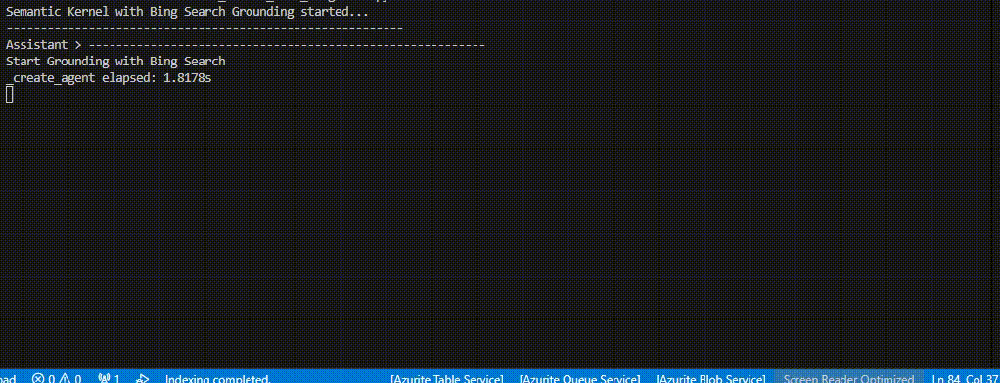

# Semantic Kernel with Bing Search Grounding

This repository shows how to use Microsoft Semantic Kernel together with Azure OpenAI (Agents) and Bing Search Grounding to retrieve web results and ground LLM responses.

## 🚀 Getting Started

This is an example of calling **Grounding with Bing Custom Search** in Semantic Kernel.
Unlike Bing Search, Grounding with Bing Search requires creating an **Agent** and a **Thread** in AI Foundry before it can be invoked.
In this example, performance optimization has not been applied, so it is not recommended to use this code as-is in a production environment.
While creating an Agent and a Thread each time is not strictly necessary, whether to do so should be determined based on the business context.



### Prerequisites
- Python 3.12
- An Azure subscription with access to:
  - Azure OpenAI (or Azure AI Foundry Agents API)
  - A Bing Search connection configured in Azure AI Foundry
- Credentials available to `DefaultAzureCredential` (e.g., Azure CLI signed in, managed identity, or environment variables)
- execute `az login` command in your dev environment before run the code.

### Setup
```bash
# Install Python 3.12 via uv
uv python install 3.12

# Install dependencies
uv sync

# Activate virtual environment
source .venv/bin/activate
```

### Environment Variables
Copy `.env.example` to `.env` and set the required values:

- AZURE_AI_FOUNDRY_PROJECT_ENDPOINT: The project endpoint for Azure AI Foundry (e.g., https://<your-hub>.<region>.models.ai.azure.com)
- AZURE_AI_FOUNDRY_API_VERSION: Agents API version (default used in code: 2025-05-15-preview)
- BING_SEARCH_CONNECTION_ID: The Bing Search connection ID configured in Azure AI Foundry
- AZURE_OPENAI_DEPLOYMENT_NAME: Your chat model deployment name (e.g., gpt-4o)
- AZURE_OPENAI_API_KEY: API key for the Azure OpenAI endpoint used by Semantic Kernel
- AZURE_OPENAI_BASE_URL: Base URL for the Azure OpenAI endpoint used by Semantic Kernel

Note: Authentication for the Agents endpoints uses `DefaultAzureCredential` (Bearer token), while Semantic Kernel’s chat service uses key/base URL.

BING_SEARCH_CONNECTION_ID is not `Id from the connection details`, please refer to the template of .env.example

in my case, the value is as follows.
`/subscriptions/<subscription-id>/resourceGroups/<resource-group-name>/providers/Microsoft.CognitiveServices/accounts/kc-aiagent-moon/connections/groundingbingmoon`


## 🧩 Project Structure
- main.py: Example app integrating Semantic Kernel with a Bing Search plugin
- grounding/bing/bing_search.py: Bing grounding client that creates agents/threads, runs, polls for status, and fetches messages
- tests/: Pytest-based tests (unit/integration)

## ▶️ Run
```bash
python main.py
```
You should see streamed assistant responses. The Bing Search plugin will call the Bing-grounded agent behind the scenes.

## 🧪 Tests
```bash
pytest -q
```
Run individual tests:
```bash
pytest -q tests/test_bing_search.py::test_bing_search
```

## ℹ️ How It Works (High level)
1. The Bing grounding tool is configured via the Agents API (assistant creation) using your `BING_SEARCH_CONNECTION_ID`.
2. A thread is created; your query is posted as a user message.
3. A run is started for the assistant; the code polls until the run completes or fails.
4. The final messages are retrieved from the thread and returned to the caller.

## 🛠️ Troubleshooting
- 401/403 Unauthorized
  - Ensure you are signed in with `az login`, or that `DefaultAzureCredential` can obtain a token.
  - Verify you have access to Azure AI Foundry and the Agents feature.
- 404/400 Errors creating assistants/threads
  - Check `AZURE_AI_FOUNDRY_PROJECT_ENDPOINT` and API version.
  - Confirm `BING_SEARCH_CONNECTION_ID` is valid.
- JSON decoding / Content-Type issues
  - The client expects JSON from the Agents API; if the response is not JSON, print the raw body and headers to diagnose.
- Pytest discovery issues
  - Ensure `tests/__init__.py` exists and test files are named `test_*.py`.

## Notes
- The freshness parameter in the grounding configuration is set to a date string (e.g., today - 3 days). Ensure your service accepts date strings; otherwise use relative values like `7d`.
- For production usage, prefer a single long-lived `aiohttp.ClientSession`, structured logging, and retries for transient errors.

---
Feel free to open issues or submit PRs to improve this sample.
